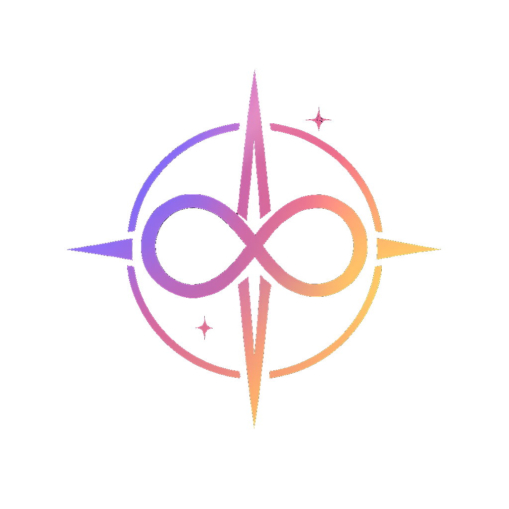

# The Infinity Compass

<div align="center">
  

  **A mystical numerology reading application that reveals your cosmic blueprint**

  [](https://reactjs.org/)
  [](https://www.typescriptlang.org/)
  [](https://vitejs.dev/)
  [](https://tailwindcss.com/)
</div>

## Overview

The Infinity Compass is a modern web application that generates personalized numerology readings based on your name and birth date. Using advanced numerological calculations and AI-powered interpretations, it creates a unique cosmic blueprint visualization in the form of an interactive diamond chart.

### Key Features

- **Personalized Numerology Calculations** - Generate detailed readings based on name and birth date
- **Interactive Diamond Chart** - Visualize your numerological blueprint with hover-enabled insights
- **AI-Enhanced Summaries** - Receive AI-generated interpretations of your numerological data
- **Mystical UI/UX** - Immersive cosmic theme with animated particles and sacred geometry
- **Export Capabilities** - Save your reading as an image
- **Mobile Responsive** - Full support for mobile and tablet devices
- **Form Validation** - Type-safe validation using Zod schemas

## Tech Stack

### Core Technologies

- **React 19** - Latest React with modern features
- **TypeScript 5.8** - Type-safe development
- **Vite 7** - Lightning-fast build tool
- **React Router v7** - Client-side routing

### Styling & UI

- **Tailwind CSS v4** - Utility-first CSS framework with custom theme
- **Radix UI** - Accessible component primitives
- **shadcn/ui** - Beautiful, reusable components
- **Framer Motion** - Smooth animations
- **Lucide React** - Icon library

### Forms & Validation

- **React Hook Form** - Performant form handling
- **Zod** - TypeScript-first schema validation
- **date-fns** - Date manipulation utilities

### Backend & APIs

- **OpenAI API** - AI-powered reading summaries
- **Alchemy API** - NFT data fetching (optional integration)
- **Discord OAuth** - User verification (optional integration)
- **Vercel Serverless Functions** - Secure backend API endpoints

## Getting Started

### Prerequisites

- **Node.js** 18+ and npm
- **Git**

### Installation

1. **Clone the repository**

```bash
git clone https://github.com/yourusername/the-infinity-compass.git
cd the-infinity-compass
```

2. **Install dependencies**

```bash
npm install
```

3. **Set up environment variables**

Create a `.env.local` file in the root directory:

```env
# Backend API Keys (for serverless functions)
OPENAI_API_KEY=sk-proj-...your-key...
ALCHEMY_API_KEY=...your-alchemy-key...
DISCORD_CLIENT_ID=...your-discord-id...
DISCORD_CLIENT_SECRET=...your-discord-secret...
```

> **Note**: API keys without the `VITE_` prefix are only accessible server-side via the backend API functions, keeping them secure.

4. **Run the development server**

```bash
npm run dev
```

The app will be available at `http://localhost:5173`

### Build for Production

```bash
npm run build
```

This creates an optimized production build in the `dist` directory.

### Preview Production Build

```bash
npm run preview
```

## Project Structure

```
the-infinity-compass/
├── api/                          # Vercel serverless functions
│   ├── health.js                 # Health check endpoint
│   ├── get-reading.js            # Generate/fetch cached readings
│   ├── generate-reading.js       # OpenAI reading generation
│   ├── fetch-nfts.js             # NFT data via Alchemy
│   ├── verify-discord.js         # Discord OAuth handler
│   └── utils/                    # Shared utilities
│       ├── cache.js              # In-memory caching
│       ├── rateLimiter.js        # Rate limiting
│       └── retry.js              # Retry logic
├── public/                       # Static assets
│   ├── logo.png                  # Application logo
│   ├── logo_transp.png           # Transparent logo
│   └── favicon-*.png             # Favicon files
├── src/
│   ├── components/
│   │   └── ui/                   # shadcn/ui components
│   ├── pages/
│   │   ├── IndividualReadingPage.tsx  # Form input page
│   │   └── ReadingPage.tsx            # Results display page
│   ├── utils/
│   │   └── numerology.ts         # Core numerology calculations
│   ├── App.tsx                   # Main app component
│   └── main.tsx                  # Application entry point
├── .env.local                    # Environment variables (not committed)
├── package.json                  # Dependencies and scripts
├── tsconfig.json                 # TypeScript configuration
├── vite.config.ts                # Vite configuration
└── vercel.json                   # Vercel deployment config
```

## API Endpoints

The application uses serverless backend functions for secure API operations:

### `POST /api/get-reading`

Generate or fetch a cached numerology reading.

**Request Body:**
```json
{
  "name": "John Doe",
  "birthdate": "1990-05-15",
  "diamondData": {
    "top": 5,
    "left": 3,
    "center": 8,
    "right": 7
  },
  "nftId": "12345",
  "showName": true
}
```

**Response:**
```json
{
  "archetype": {
    "title": "The Cosmic Wanderer",
    "tagline": "You walk between worlds..."
  },
  "oneLiner": "Your cosmic blueprint reveals...",
  "summary": "Detailed reading summary...",
  "highlightWords": ["Leadership", "Wisdom", "Transformation"],
  "visualCue": ["✨", "🌟", "🔮"],
  "cached": false
}
```

**Features:**
- 30-day caching for identical readings
- Rate limiting: 5 requests/minute per IP
- Automatic retry with exponential backoff

### `GET /api/fetch-nfts?wallet=0x...`

Fetch NFT data for a given wallet address (optional feature).

**Response:**
```json
{
  "nfts": [
    {
      "tokenId": "1234",
      "contractAddress": "0xe785...",
      "imageUrl": "https://...",
      "name": "WoW #1234",
      "collection": "WoW"
    }
  ],
  "cached": false,
  "count": 1
}
```

**Cache TTL:** 15 minutes

### `GET /api/verify-discord?code=...`

Handle Discord OAuth verification (optional feature).

**Response:**
```json
{
  "verified": true,
  "discordId": "123456789",
  "username": "johndoe",
  "avatar": "...",
  "cached": false
}
```

**Cache TTL:** 10 minutes

### `GET /api/health`

Health check endpoint for monitoring.

**Response:**
```json
{
  "status": "ok",
  "timestamp": "2025-10-15T...",
  "cache": {
    "total": 5,
    "expired": 0,
    "active": 5
  },
  "environment": "production"
}
```

## Numerology Calculation System

The Infinity Compass uses a sophisticated numerology calculation system based on Chaldean numerology principles:

### Core Calculations

- **Letter-to-Number Mapping** - Each letter is assigned a number (1-9)
- **Name Values** - Calculate numerological values from full name
- **Birthday Interpretation** - Planetary associations and personality traits
- **Compound Numbers** - Advanced interpretations (10/1 through 99/9)
- **Diamond Chart** - Visual representation of numerological relationships

### Diamond Chart Structure

The diamond chart displays four key positions:

- **Top (Upper)** - Birth day reduced to single digit
- **Left (First Name)** - First name numerology value
- **Center (Essence)** - Core life path number
- **Right (Last Name)** - Last name numerology value

Additional layers include mid values, circle values, and compound number interpretations.

## Deployment

### Local Development Setup

#### 1. Install Dependencies

```bash
npm install
```

#### 2. Configure Environment Variables

Create a `.env` file in the root directory:

```env
# Frontend Variables (VITE_ prefix - exposed to browser)
VITE_API_URL=http://localhost:3001
VITE_DISCORD_CLIENT_ID=your_discord_client_id_here

# Backend Variables (server-side only - NO VITE_ prefix)
OPENAI_API_KEY=sk-proj-...your-key...
ALCHEMY_API_KEY=...your-alchemy-key...
DISCORD_CLIENT_ID=...your-discord-client-id...
DISCORD_CLIENT_SECRET=...your-discord-client-secret...
DISCORD_REDIRECT_URI=http://localhost:3001/api/verify-discord
FRONTEND_CALLBACK_URL=http://localhost:3001/auth/callback
WOW_GUILD_ID=...your-guild-id...
WOW_ROLE_ID=...your-wow-role-id...
WOWG_ROLE_ID=...your-wowg-role-id...
```

**Important:**

- Frontend variables need `VITE_` prefix (exposed to browser)
- Backend variables have NO prefix (server-side only, secure)
- The `.env` file is gitignored and will never be committed

#### 3. Configure Discord Developer Portal

Add these redirect URIs to your Discord app:

- `http://localhost:3001/api/verify-discord`
- `http://localhost:3001/auth/callback`

#### 4. Run Development Server

```bash
vercel dev --listen 3001
```

Access the app at: <http://localhost:3001>

**Note:** Port 3001 is required for Discord OAuth redirects to work correctly.

---

### Production Deployment to Vercel

#### 1. Connect Repository

- Go to <https://vercel.com/new>
- Import your GitHub repository
- Vercel will auto-detect the Vite framework

#### 2. Set Environment Variables in Vercel Dashboard

Go to **Settings → Environment Variables** and add all variables from your `.env` file.

**Update these 3 for production:**

```env
VITE_API_URL=https://your-app.vercel.app
DISCORD_REDIRECT_URI=https://your-app.vercel.app/api/verify-discord
FRONTEND_CALLBACK_URL=https://your-app.vercel.app/auth/callback
```

Replace `your-app.vercel.app` with your actual Vercel domain.

#### 3. Update Discord Developer Portal

Add production redirect URIs:

- `https://your-app.vercel.app/api/verify-discord`
- `https://your-app.vercel.app/auth/callback`

#### 4. Deploy

##### Option A: Auto-deploy via Git (Recommended)

```bash
git push origin main
```

Vercel automatically deploys on push.

##### Option B: Manual deploy via CLI

```bash
npm install -g vercel
vercel --prod
```

---

### Environment Variable Reference

**When switching between local/production, update these 3 variables:**

| Variable | Local | Production |
|----------|-------|------------|
| `VITE_API_URL` | `http://localhost:3001` | `https://your-app.vercel.app` |
| `DISCORD_REDIRECT_URI` | `http://localhost:3001/api/verify-discord` | `https://your-app.vercel.app/api/verify-discord` |
| `FRONTEND_CALLBACK_URL` | `http://localhost:3001/auth/callback` | `https://your-app.vercel.app/auth/callback` |

**Rule:** All three should use the **SAME base URL**.

## Development

### Available Scripts

- `npm run dev` - Start development server with hot reload
- `npm run build` - Build for production
- `npm run preview` - Preview production build locally
- `npm run lint` - Run ESLint

### Testing Backend APIs Locally

Once your server is running with `vercel dev --listen 3001`, you can test the API endpoints:

#### Health Check

```bash
curl http://localhost:3001/api/health
```

**Expected Response:**

```json
{
  "status": "ok",
  "timestamp": "2025-10-15T...",
  "cache": {
    "total": 0,
    "expired": 0,
    "active": 0
  },
  "environment": "development"
}
```

#### Generate Reading

```bash
curl -X POST http://localhost:3001/api/get-reading \
  -H "Content-Type: application/json" \
  -d '{
    "name": "John Doe",
    "birthdate": "1990-05-15",
    "diamondData": {
      "top": 5,
      "left": 3,
      "center": 8,
      "right": 7
    },
    "nftId": "12345",
    "showName": true
  }'
```

**Expected Response:**

```json
{
  "archetype": {
    "title": "The Cosmic Wanderer",
    "tagline": "You walk between worlds..."
  },
  "oneLiner": "Your cosmic blueprint reveals...",
  "summary": "...",
  "highlightWords": ["Leadership", "Wisdom", "Transformation"],
  "visualCue": ["✨", "🌟", "🔮"],
  "cached": false
}
```

Second call with same data should return `"cached": true` and be instant.

#### Fetch NFTs

```bash
curl "http://localhost:3001/api/fetch-nfts?wallet=0x1234567890abcdef1234567890abcdef12345678"
```

**Expected Response:**

```json
{
  "nfts": [
    {
      "tokenId": "1234",
      "contractAddress": "0xe785E82358879F061BC3dcAC6f0444462D4b5330",
      "imageUrl": "https://...",
      "name": "WoW #1234",
      "collection": "WoW"
    }
  ],
  "cached": false,
  "count": 1
}
```

### Troubleshooting

#### Environment variables not working

- Backend APIs use `process.env.VARIABLE_NAME` (no `VITE_` prefix)
- Frontend uses `import.meta.env.VITE_VARIABLE_NAME` (with `VITE_` prefix)
- Restart `vercel dev` after changing `.env`

#### Discord Auth Error: "service_unavailable"

- Check that all Discord env vars are set in `.env`
- Verify redirect URIs match exactly in Discord Developer Portal

#### Function timeout

Increase timeout in `vercel.json`:

```json
{
  "functions": {
    "api/**/*.js": {
      "maxDuration": 30
    }
  }
}
```

## Security

- **API Key Protection** - All sensitive keys stored server-side only
- **Rate Limiting** - Prevents abuse with configurable limits
- **Input Validation** - Zod schemas validate all user input
- **CORS Configuration** - Proper origin restrictions
- **No Client-Side Secrets** - No `dangerouslyAllowBrowser` flags

## Contributing

Contributions are welcome! Please follow these steps:

1. Fork the repository
2. Create a feature branch (`git checkout -b feature/amazing-feature`)
3. Commit your changes (`git commit -m 'Add amazing feature'`)
4. Push to the branch (`git push origin feature/amazing-feature`)
5. Open a Pull Request

## License

This project is private and proprietary. All rights reserved.

## Acknowledgments

- Numerology calculations based on Chaldean numerology system
- UI components from [shadcn/ui](https://ui.shadcn.com/)
- Icons from [Lucide](https://lucide.dev/)
- AI-powered by [OpenAI](https://openai.com/)

## Support

For issues or questions:
- Open an issue on GitHub
- Contact the development team

---

<div align="center">
  Made with cosmic energy ✨
</div>


## Info Page

# 🌙 About The Fortune Teller

Welcome, traveler — before you step through the portal, let’s align your energy with the stars.

---

## 🔢 The Wisdom of Numerology
The **Fortune Teller** draws inspiration from *Cheiro’s Numerology*, a system that connects the vibrations of numbers to personality, destiny, and life purpose.  
In this philosophy, every number carries a hidden rhythm — revealing how we move through the world and how the universe responds in kind.

Each reading is guided by these ancient principles, blending mathematics with mysticism to illuminate your unique path.

---

## ✨ Your Name and Your Ground Energy
To open your portal, you’ll be asked for two key elements:

- **Your Name** — the vibration that shapes your *Life Path*, reflecting your purpose and outward expression.  
- **Your Birthday** — your *Ground Energy*, anchoring your journey and revealing the core rhythm of your soul.

These details are used **only to calculate your numerological signature** — nothing is stored, shared, or linked to your Discord or wallet.  
They serve purely to align your personal energy with your chosen NFT’s cosmic frequency.

---

## 🪄 Why Discord Login?
We use **Discord authentication** to recognize verified **World of Women** and **World of Women Galaxy** holders —  
a seamless way to confirm community membership **without requiring a wallet connection**.  
Your privacy remains fully protected; the app receives only your Discord ID and username.

---

## 💫 Merging Your Energy with Your NFT
Your **WoW or WoWG NFT** acts as a cosmic mirror — a reflection of grace, color, and energy.  
By merging your numerological profile with your NFT, the Fortune Teller reveals how your personal essence and your artwork’s aura harmonize.  
Together, they form a portrait of your creative and spiritual alignment — a fusion of art, soul, and symbolism.

---

## 🌕 Questions or Thoughts?
If you have any questions or insights to share, the Fortune Teller welcomes your message.  
Reach out in the **#fortune-teller** channel on Discord — or send a DM to **@InfinityCompass** on X.  
Your journey is uniquely yours — but the stars love curious minds.

---

> *“Numbers are the language of fate — and art, its most beautiful accent.”*  
> — The Fortune Teller 🔮


Visual & UX Design Spec

Goal: keep page visually and emotionally consistent with the rest of the app (Indigo → Coral gradient palette, glassmorphism cards, soft glow accents). The Fortune Teller and the Infinity Compass logo should appear, but the page must not interrupt the login flow — it’s informational and optional.

Layout (desktop)

Header (small): left-aligned Infinity Compass logo (svg) + top-right “Close / Back to Portal” button.

Hero section (centered):

Left: Fortune Teller portrait (rounded, subtle glow) — optional small caption “The Fortune Teller”.

Right: Title + intro line (the first line of copy).

Content area below hero: 2-column glassmorphism card

Column A: left column block contains the numerology explanation + name/birthday section

Column B: right column block contains Discord login explanation + merging NFT explanation + contact block

Footer: subtle gradient footer with small tagline and link back to /login.

Layout (mobile)

Single column: top logo, hero image, title, then the sections stacked.

Keep Fortune Teller smaller and centered above the copy.

CTA (“Back to Portal”) at bottom as sticky button.

Visual treatments

Background: same as app — Cosmic Black → Midnight Indigo gradient.

Card: glassmorphism panel: backdrop-filter: blur(8px); background: rgba(255,255,255,0.03); border: 1px solid rgba(255,255,255,0.06)

Accent color: Celestial Violet → Solar Coral gradient for buttons and small heading markers.

Fonts: Title Playfair Display (or similar elegant serif). Body Inter or Poppins.

Imagery

Use the fortune_teller.webp (transparent) on the hero; add a soft halo glow (CSS drop-shadow).

Place the logo_transp.png (Infinity Compass) in the header, small and left aligned.

🧩 Component Breakdown (React / Vite)

Suggested file structure:

src/
 ├─ pages/
 │   └─ InfoPage.jsx
 ├─ components/
 │   ├─ InfoHero.jsx
 │   ├─ InfoCard.jsx
 │   ├─ LogoSmall.jsx
 │   └─ FortuneTellerPortrait.jsx
 ├─ assets/
 │   ├─ fortune_teller.webp
 │   └─ logo_transp.png

Suggested React components
LogoSmall.jsx

Small SVG / PNG logo with alt="Infinity Compass logo".

Props: size, className.

FortuneTellerPortrait.jsx

Renders the fortune teller image with halo and optional animation.

Props: size="md|lg", ariaLabel.

InfoHero.jsx

Layout for hero area: left portrait + right title/lead copy.

Takes title, leadText.

InfoCard.jsx

Reusable glassmorphism card component to hold sections (numerology, privacy, discord, NFT merge, contact).

Accessibility: role="region", aria-labelledby.

InfoPage.jsx

Page wrapper that composes the above components and contains the full approved copy.

💻 Example React + Tailwind snippets

These are tiny templates to implement quickly. Adapt class names to your project.

InfoPage.jsx

import LogoSmall from '@/components/LogoSmall';
import FortuneTellerPortrait from '@/components/FortuneTellerPortrait';
import InfoCard from '@/components/InfoCard';

export default function InfoPage() {
  return (
    <main className="min-h-screen bg-gradient-to-b from-[#0C0A1E] to-[#1D1B3A] text-ivory p-6">
      <header className="max-w-6xl mx-auto flex items-center justify-between py-6">
        <LogoSmall className="w-28" />
        <a href="/login" className="text-sm px-4 py-2 rounded-md bg-gradient-to-r from-[#9B8DE3] to-[#FF8674] text-white">Back to portal</a>
      </header>

      <section className="max-w-6xl mx-auto grid md:grid-cols-2 gap-8 items-center py-8">
        <div className="flex justify-center md:justify-end">
          <FortuneTellerPortrait size="lg" />
        </div>

        <div>
          <h1 className="text-4xl font-serif text-ivory mb-2">About The Fortune Teller</h1>
          <p className="text-indigo-100 max-w-xl">
            Welcome, traveler — before you step through the portal, let’s align your energy with the stars.
          </p>
        </div>
      </section>

      <section className="max-w-5xl mx-auto grid gap-6">
        <InfoCard title="The Wisdom of Numerology">
          {/* paste section copy content here */}
        </InfoCard>
        <InfoCard title="Your Name and Your Ground Energy">
          {/* paste section copy here */}
        </InfoCard>
        <InfoCard title="Why Discord Login?">
          {/* paste section copy here */}
        </InfoCard>
        <InfoCard title="Merging Your Energy with Your NFT">
          {/* paste section copy here */}
        </InfoCard>
        <InfoCard title="Questions or Thoughts?">
          {/* paste contact copy here */}
        </InfoCard>
      </section>

      <footer className="max-w-6xl mx-auto text-center py-10 text-sm text-indigo-300">
        “Numbers are the language of fate — and art, its most beautiful accent.” — The Fortune Teller
      </footer>
    </main>
  );
}


InfoCard.jsx

export default function InfoCard({ title, children }) {
  return (
    <article role="region" aria-labelledby={title.replace(/\s+/g, '-').toLowerCase()} className="p-6 rounded-2xl bg-[rgba(255,255,255,0.025)] border border-[rgba(255,255,255,0.04)] backdrop-blur-sm">
      <h2 id={title.replace(/\s+/g, '-').toLowerCase()} className="text-xl font-semibold text-ivory mb-2">{title}</h2>
      <div className="text-indigo-100 text-sm">{children}</div>
    </article>
  );
}


FortuneTellerPortrait.jsx

export default function FortuneTellerPortrait({ size='md', ariaLabel='Fortune Teller portrait' }) {
  const dims = size === 'lg' ? 'w-72' : 'w-48';
  return (
    <div className={`relative ${dims}`}>
      
      <div className="absolute inset-0 rounded-full pointer-events-none" style={{ boxShadow: '0 0 40px rgba(155,141,227,0.25)' }} />
    </div>
  );
}

♿ Accessibility & Privacy Notes

Use semantic headings (h1 → h2 → h3) and role="region" with aria-labelledby on content cards.

Provide alt text for logo and portrait: e.g., alt="The Fortune Teller — World of Women NFT portrait".

High contrast: ensure text over gradients meets AA contrast (use Ivory #F4E8DC for main text).

Privacy wording: keep the explicit statement that name + birthday are used only for numerology computation and are not stored. If you do store any reading for caching, note that in the privacy copy (transparency).

Provide a link to a fuller privacy policy in the footer (or a modal) if you plan to persist readings server-side.